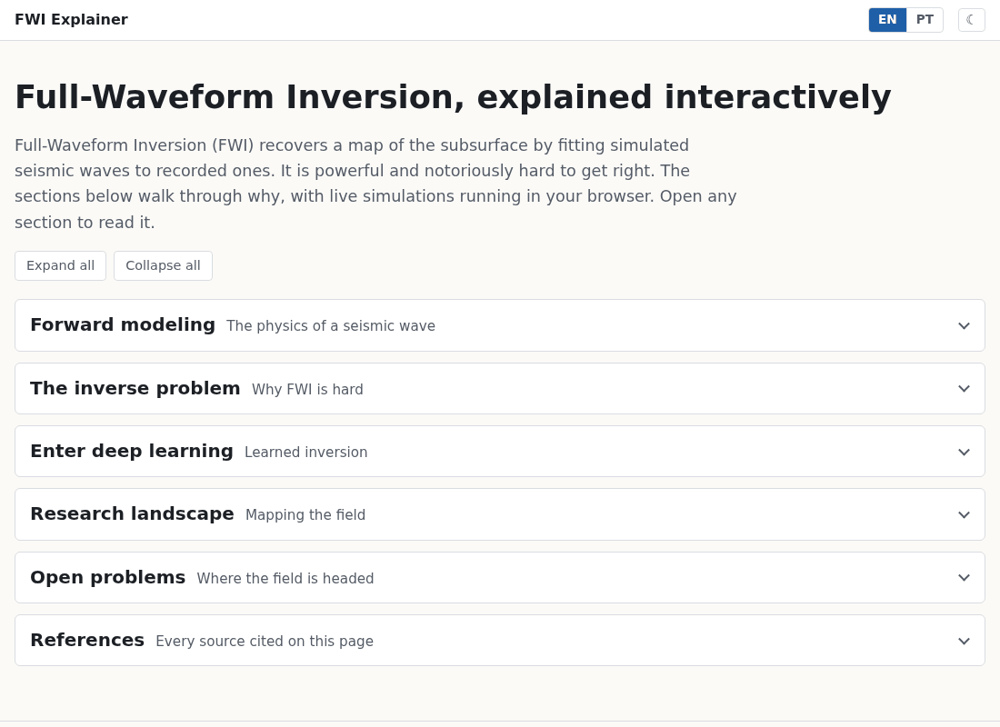
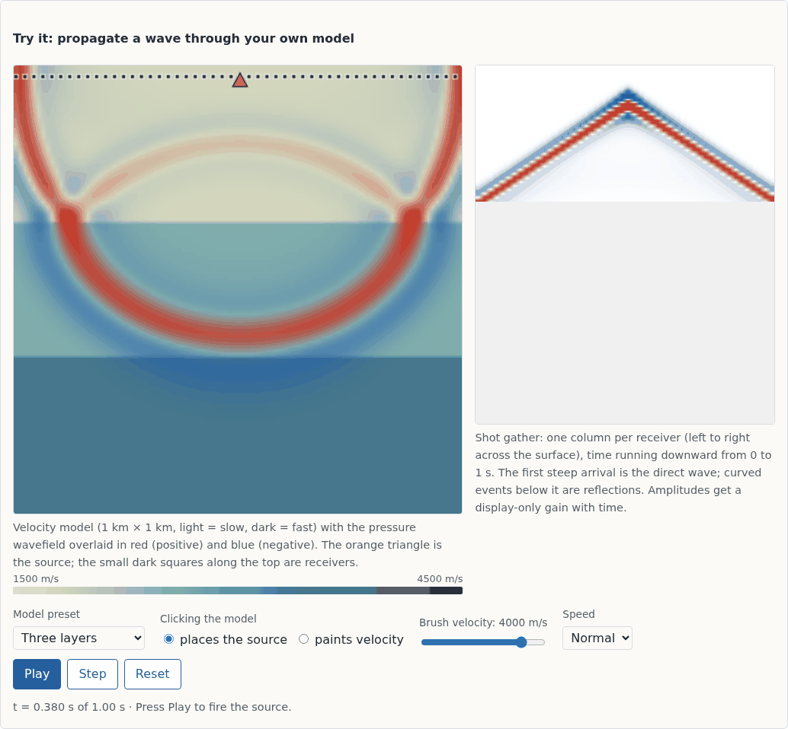
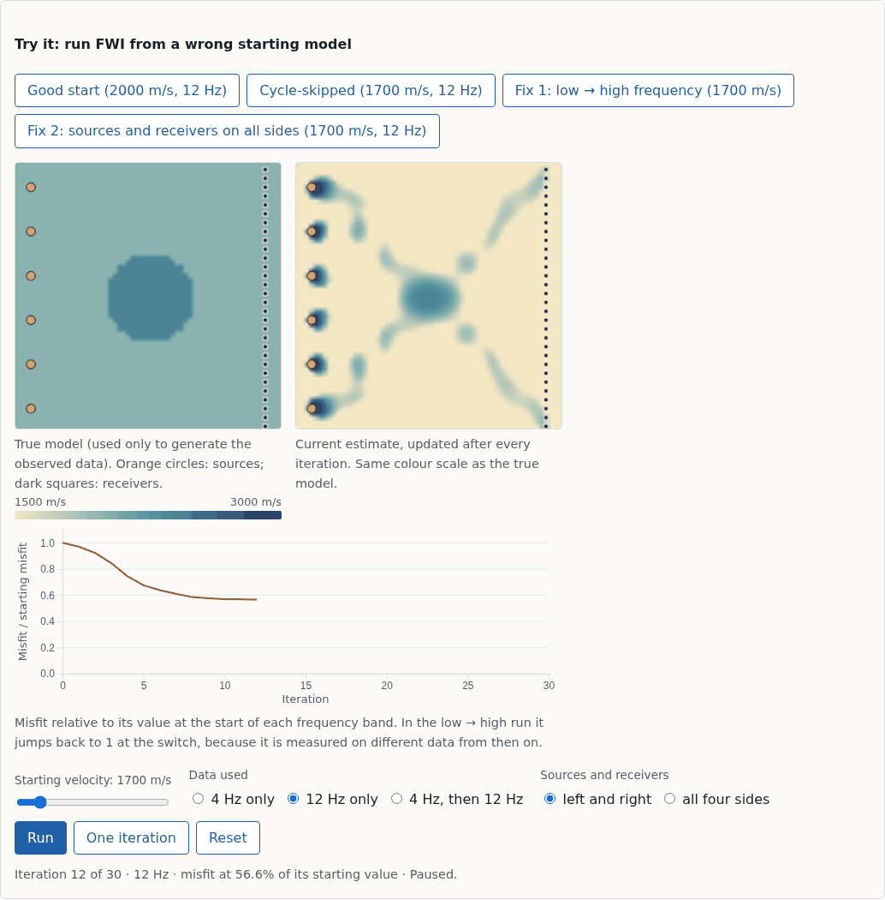

# FWI Explainer

**Live: https://barbieriht.github.io/fwi-explainer/** · [Português](https://barbieriht.github.io/fwi-explainer/index.pt.html)

An interactive, in-browser explainer of seismic Full-Waveform Inversion (FWI)
and deep-learning approaches to it. The wave simulations and the inversion
run live in the browser; there is no backend, no build step and no network
request at runtime. Built as part of ongoing PhD research in AI at the
University of São Paulo (USP).



## What is inside

- **Forward modeling.** A 2D acoustic finite-difference solver: paint a
  velocity model, place the source, and watch the wavefield and the shot
  gather build up.
- **The inverse problem.** Adjoint-state FWI in the browser. A misfit
  landscape and four inversion scenarios show cycle-skipping, and two ways
  around it.
- **Deep learning.** A classical-vs-network comparison computed offline on a
  laptop GPU, including a case where the network fails on unfamiliar
  geology.
- **Research landscape, open problems, references.** Built from the author's
  bibliography (40 papers), with every citation resolving to a real entry.

| Forward modeling | Cycle-skipping |
|---|---|
|  |  |

## How the page is organized

A single page with collapsible sections. Each demo starts only when its
section is opened and pauses when it is closed. Any section or reference can
be linked directly (e.g. `index.html#inverse-problem`). The header has an
EN/PT language switch, which keeps the current section, and a light/dark
theme toggle, which defaults to the system setting.

The two languages are two files, `index.html` and `index.pt.html`, maintained
side by side: edit the prose in both and keep their structure identical
(tests compare ids, controls, scripts and citations). Strings produced by the
demos at runtime live in `assets/js/i18n.js`.

## Run locally

Clone the repository and open `index.html` in a browser; nothing needs to be
installed. Or serve the folder:

```sh
python3 -m http.server 8000   # then visit http://localhost:8000
```

## Tests

```sh
node --test
```

Node 18+ and no dependencies. The tests cover the wave solver (stability,
arrival times, absorbing boundaries), the inversion (the adjoint-state
gradient is checked against finite differences to within 1%), the literature
data, the generated page content and the parity of the two language versions.

## Content pipeline

The literature on the page comes from the author's thesis bibliography, never
from hand-typed entries:

```sh
# 1. Import the corpus (classical FWI, the 16-paper deep-learning FWI survey,
#    and the machine-learning-oriented line) from the thesis .bib
node scripts/import-literature.js "/path/to/Overleaf Project/references.bib"

# 2. Fill the generated parts of index.html and index.pt.html
node scripts/build-page.js          # rewrite
node scripts/build-page.js --check  # fail if out of date (also a test)
```

- `import-literature.js` copies bibliographic fields only (the .bib's working
  comments are never read), marks entries with a `% VERIFY` note as not yet
  verified, and derives topic tags from titles with explicit keyword rules.
  It writes `assets/data/literature.json` and a `literature.js` twin, so the
  page also works when opened from disk.
- In both pages, prose is hand-written. Lists of papers are written as
  `<span class="cite-list" data-cite-list="tag=uncertainty">` and inline
  citations as `<a class="cite" data-cite="id">`. `build-page.js` fills
  both from the data, then generates the References section, listing
  every cited entry and the sections citing it.
- `assets/data/foundational-references.json` holds the few textbook
  references that are not in the thesis bibliography.

Tests fail if a citation does not resolve, if a tag does not follow from its
title, if either page is out of date, or if the two language versions drift
apart structurally.

## Deep-learning comparison (offline)

The deep-learning section shows one pre-computed comparison between classical FWI
and a trained network. Everything is generated locally with PyTorch on a
consumer GPU; no cloud services are involved. Outputs that are committed:
`assets/img/dl/*.png` and `assets/data/dl-comparison.{json,js}`.

```sh
cd scripts/dl
python3 generate_dataset.py --out ../../data-src/dl   # synthetic models + shot gathers (~10 min)
python3 train.py --data ../../data-src/dl             # encoder-decoder network
python3 compare.py --data ../../data-src/dl           # classical FWI vs network, writes site assets
```

`data-src/` (dataset and checkpoints) is git-ignored. The simulator in
`scripts/dl/common.py` uses the same scheme as the browser solver and matches
it to within 1e-5 relative error.

## Credits

- Standard numerical methods (finite-difference time-domain wave simulation,
  adjoint-state gradients, sponge boundaries, multiscale inversion) are
  cited on the page where they are introduced.
- No figure, table or text is reproduced from any paper; every visual is
  computed from the equations or from the author's own experiments.

## Third-party code

Vendored in `assets/vendor/` with their licenses:

- [D3](https://d3js.org) v7.9.0 — ISC
- [KaTeX](https://katex.org) v0.16.47 — MIT

## License

MIT — see [LICENSE](LICENSE).
